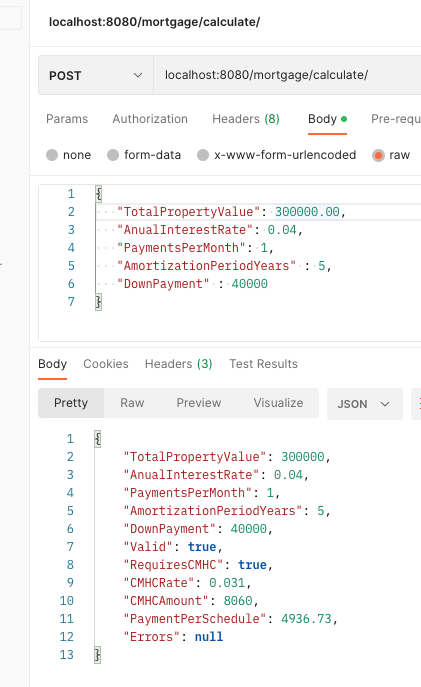
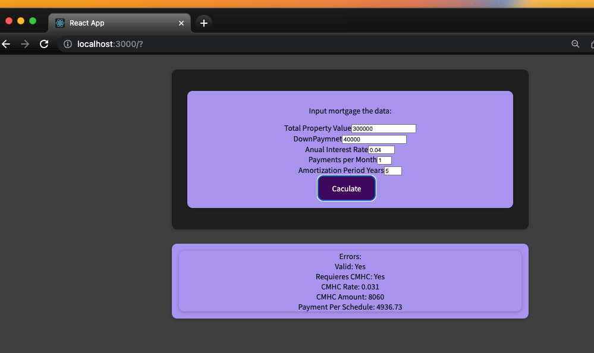
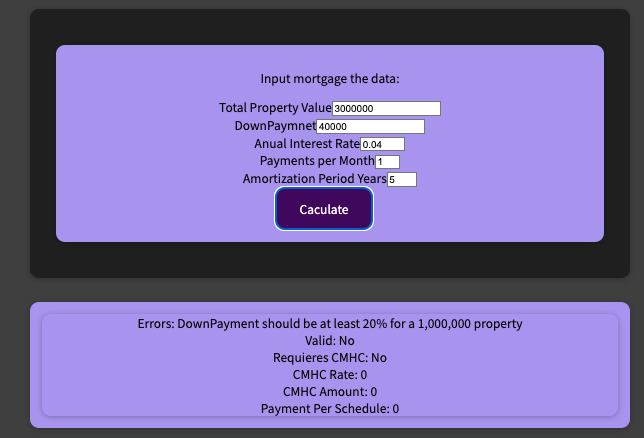

# quoter-test

## Design Considerations
The present implementation uses a rule engine library, as this seems to fit in the proposed scenario
where rules correspond to laws, direct business directives and seems to be likely to change over time. 

As an advantages we can state:

* Business Rules are separated from code and easy to read and understand by an SME
* Easy to maintain and understand that a "code" implementation 

# ToDos
Due time constraints, the following aspect where not implemented, but it does mean those are less on not important;

1. Logging
2. Security
3. Automated test are not exhaustive, but test included shows the implementation proposal for unit test.
4. Only "British Columbia Mortgage Default Insurance Rates", has been considered 
5.-Validations, not all validations are in place 
6. Integration test (direct http calls to the api), are neglected due time constraint, still those are necessary, UI automated test follow the same.
7.- Calculations has not been exhaustive compared with "real life" examples.

## Running Locally

Code can be executed using:
````
go install 
go run main.go 
````

To create a request to the back end any http client tool can be use, in this case we use postman:



## Test

Tests can be run using:

````
go test ./...
````

## UI
UI it's pretty fragile, and it's finally it's just a demo
client, it's recommended to use defaults values at first , to validate system it's working.

Install and Run : 

Verify the back end is running (you can use postman), then in the "ui" directory : 

To install:
````
npm install 
````

To Run: 
````
npm 
````




Errors in calculations are shown as: 

